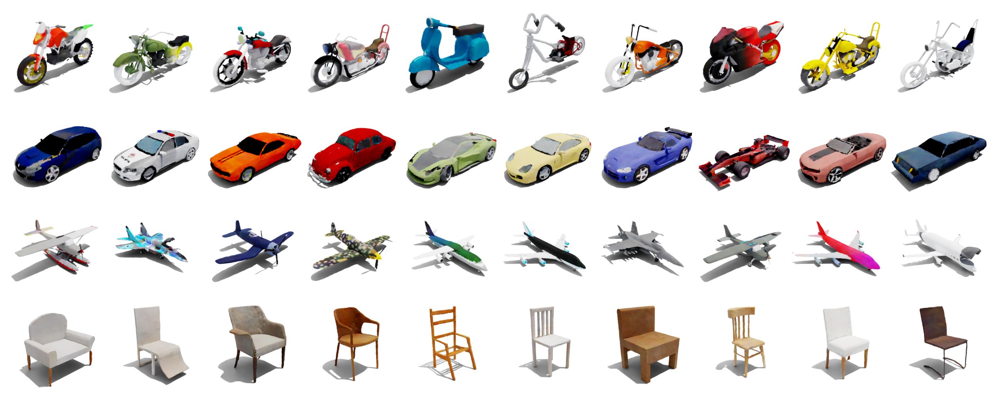

# TetraDiffusion: Tetrahedral Diffusion Models for 3D Shape Generation

<div align="center">

[**Nikolai Kalischek<sup>*,1</sup>**](https://github.com/D1noFuzi), [**Torben Peters<sup>*,1</sup>**](https://github.com/PeterTor/), [**Jan Dirk Wegner<sup>2</sup>**](https://scholar.google.com/citations?user=sxLG1rgAAAAJ&hl),[**Konrad Schindler<sup>1</sup>**](https://scholar.google.com/citations?user=FZuNgqIAAAAJ&hl)

<sup>1</sup> ETH Zürich <sup>2</sup> University of Zürich

<sup>*</sup> equal contribution

[](https://tetradiffusion.github.io/)
[](https://arxiv.org/abs/2211.13220)

</div>



***TetraDiffusion** is a 3D denoising diffusion model that operates on a tetrahedral grid to enable the generation of high-resolution 3D shapes in seconds. All depicted meshes are shown without any postprocessing, hole-filling or smoothing.*


### 🛠️ Setup 

To set up the environment, follow these steps:

1. **Install Conda** from [Anaconda website](https://www.anaconda.com/products/distribution#download-section).

2. **Clone the repository** and change to directory.
   ```bash
   git clone git@github.com:PeterTor/TetraDiffusion.git
   cd TetraDiffusion/

3. **Create the environment** using `environment.yml`.
   ```bash
   conda env create -f environment.yml
   conda activate TetraDiffusion

### 🚀 Inference 
Pre-trained models for inference will be available in a future update. To run inference:
1. Place weights in folder `./results/{class_resolution}/`
2. Run inference, e.g. 
    ```bash
   python inference.py --config_path="results/bike_128/"

### ⚙️ Dataset (generation)
We will provide processed datasets and scripts for generating tetrahedralized meshes (optimized within the tetrahedral grid) in a future update. The dataset will be available for download. To create your own dataset, follow the instructions in the preprocessing folder.
### 🏋️ Training


## Citation

   ```bibtex
   @article{kalischek2023tetradiffusion,
     title={TetraDiffusion: Tetrahedral Diffusion Models for 3D Shape Generation},
     author={Kalischek, Nikolai and Peters, Torben and Wegner, Jan D and Schindler, Konrad},
     journal={arXiv preprint arXiv:2211.13220v3},
     year={2023}
   }
   ```

### Acknowledgment

Parts of this repository are adpated from [nvdiffrec](https://github.com/NVlabs/nvdiffrec).
