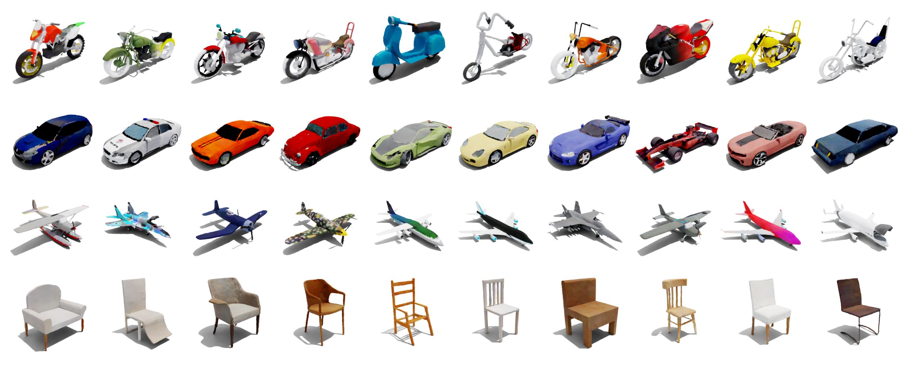

# <p align="center"> TetraDiffusion: Tetrahedral Diffusion Models for 3D Shape Generation </p>
###  <p align="center"> [Nikolai Kalischek<sup>*,1</sup>](https://github.com/D1noFuzi), [Torben Peters<sup>*,1</sup>](https://github.com/PeterTor/), [Jan Dirk Wegner<sup>2</sup>](https://scholar.google.com/citations?user=sxLG1rgAAAAJ&hl),[Konrad Schindler<sup>1</sup>](https://scholar.google.com/citations?user=FZuNgqIAAAAJ&hl)</p>
#### <p align="center"> <sup>1</sup> ETH Zürich <sup>2</sup> University of Zürich </p>
#### <p align="center"> <sup>*</sup> equal contribution</p>

### <p align="center"> [Paper](https://arxiv.org/xxxxx) | [Project Page](https://tetradiffusion.github.io/)


***TetraDiffusion** is a 3D denoising diffusion model that operates on a tetrahedral grid to enable the generation of high-resolution 3D shapes in seconds. All depicted meshes are shown without any postprocessing, hole-filling or smoothing.*


# Code will be released soon!

## Citation

```bibtex
@article{kalischek2023tetradiffusion,
  title={TetraDiffusion: Tetrahedral Diffusion Models for 3D Shape Generation},
  author={Kalischek, Nikolai and Peters, Torben and Wegner, Jan D and Schindler, Konrad},
  journal={arXiv preprint arXiv:2211.13220v2},
  year={2023}
}}
